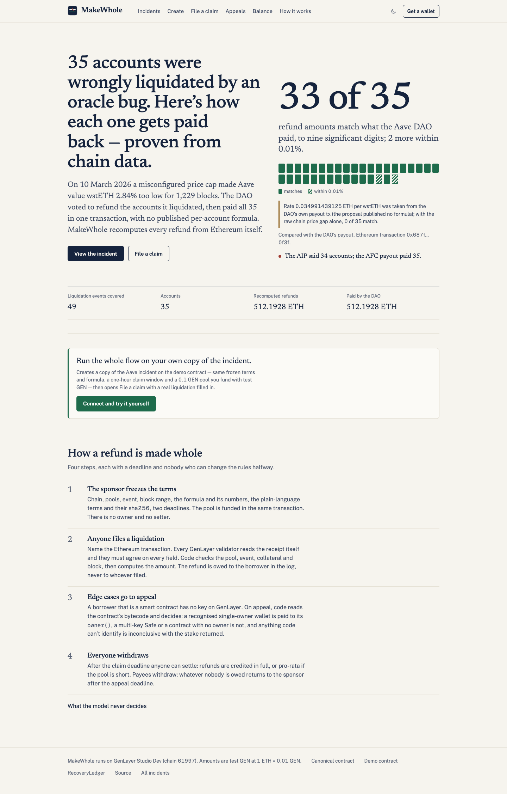
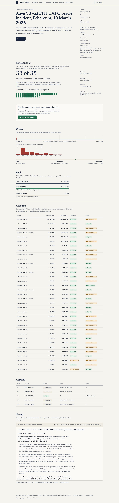
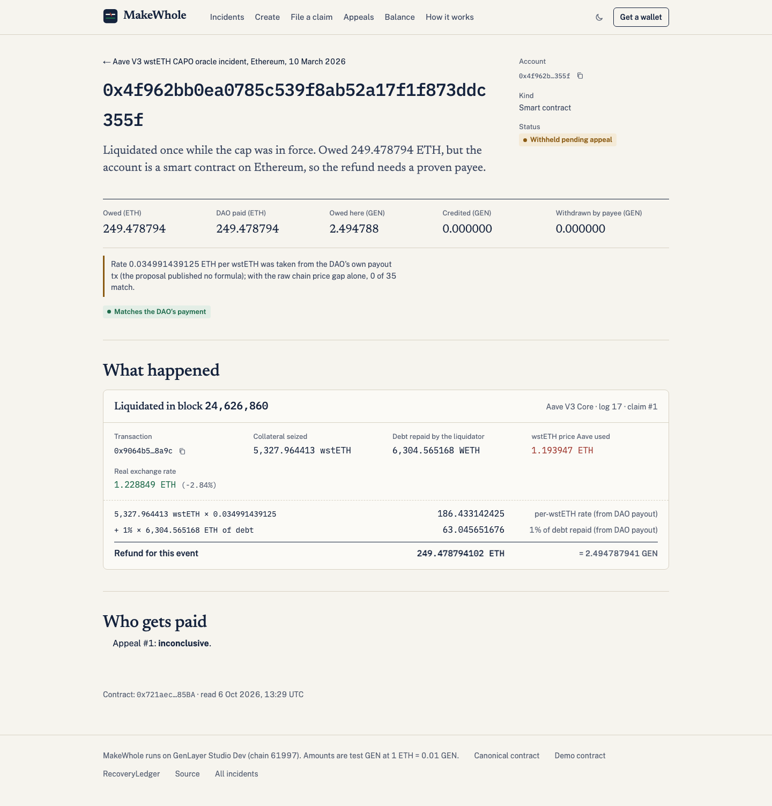
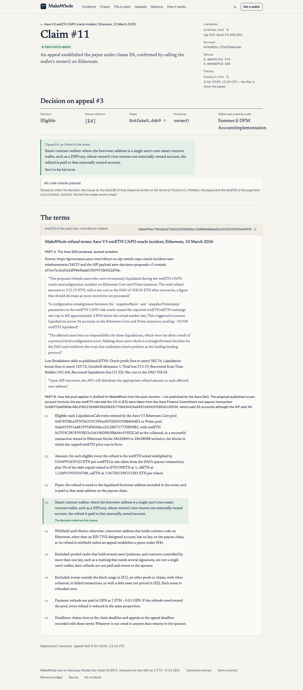
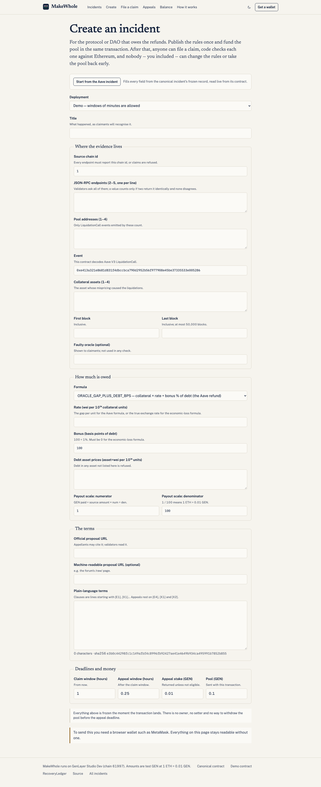
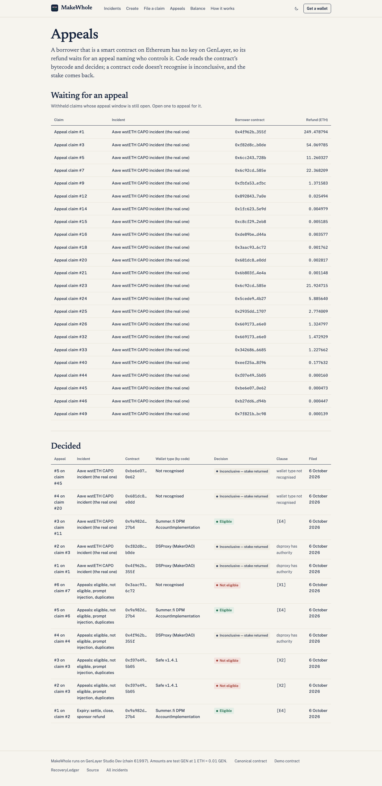

# MakeWhole

**Verifiable refunds after a protocol incident.** Frozen terms, claims checked against real chain data, appeals for the edge
cases, pull payouts — on GenLayer.

<p></p>

| | |
|---|---|
| **Live app** | https://makewhole-ledger.vercel.app |
| **Network** | GenLayer Studio Dev, chain `61997` — [explorer](https://explorer-studio-dev.genlayer.com/) |
| **MakeWhole — canonical** (the real incident; 30-day claim window, 14-day appeal window) | `0x721aec66070f54082164B58fB8E2e6f1E6A085BA` |
| **MakeWhole — demo** (same source; windows of minutes) | `0x3265AfB9e1f311698f85f7AF4FD890303Cd39Ad1` |
| **RecoveryLedger** (read-only consumer; no payable method) | `0x59941E298EF8b3C4BcDdE0674a19EdC55DD1362B` |
| **Commit deployed** | `4d7a293bc47241643b6c6c40286562324e412a76` — sha256 of `contracts/MakeWhole.py`: `7b3e9dd2d52fe3b2eebb639b5b215ccfdbbf58f80840d465628270acdd698bed` |
| **Offline tests** | `python3 test/test_makewhole.py` (stdlib only, 117 tests, including both attack rounds and the stability check) |
| **Demo video** | [`docs/demo/makewhole-demo.mp4`](docs/demo/makewhole-demo.mp4) (82 s) |

More: [research](docs/RESEARCH.md) · [threat model](docs/THREAT_MODEL.md) · [seeds](docs/SEEDS.md) · [addresses](ADDRESSES.md) · [tasks](docs/TASKS.md) · superseded [v1](docs/superseded/v1/README.md), [v1.1](docs/superseded/v1.1/README.md), [v1.2](docs/superseded/v1.2/README.md)

## The problem

On **10 March 2026** a misconfigured CAPO price cap made Aave value wstETH **2.84% below** its real exchange rate on its
Ethereum Core and Prime markets. For 1,229 blocks the cap was wrong; in the first eight of them, 49 liquidations seized
**10,938.59 wstETH** (~$27M) from **35 accounts** that were never underwater.

The Aave DAO did the right thing: [a proposal](https://governance.aave.com/t/direct-to-aip-wsteth-capo-oracle-incident-user-reimbursement/24275)
approved **513.19 ETH** of refunds, and on 27 March the Aave Finance Committee paid 35 addresses in
[one transaction](https://etherscan.io/tx/0x687f2a608fbc48c2f90130fd6f3620835770b03424ed497a5002f095d1c00f3f).
But the process was a forum post, one multisend transaction and trust. The on-chain payload was a single `approve()`; the promised
per-user breakdown never appeared. Forum members asked for it twice after the money went out, and one said a payment
"looks to be ~20 weth short". Nobody outside could check.

MakeWhole makes that process checkable. A sponsor freezes the terms before anyone files. Anyone can file a liquidation.
Every GenLayer validator reads the liquidation from Ethereum itself and the code computes the refund. Edge cases are
appealed against the frozen terms. Refunds are pulled, never pushed. Every number in the app comes from a contract call.

## Did it reproduce the DAO? 33 of 35 — with a rate taken from the DAO's payout

We recovered the DAO's formula from its own payouts ([RESEARCH.md §5](docs/RESEARCH.md#5-reproducing-the-daos-amounts)):

```
refund = wstETH seized × 0.034991439125 ETH  +  1% × debt repaid (in ETH)
```

Frozen into the canonical incident and computed by the contract from each receipt, **33 of 35 accounts match the
DAO's payment** to nine significant digits, **2 are within 0.004%** (their debt was cbETH and osETH; we price it with
Aave's oracle in the liquidation block, the DAO used a slightly different price), **0 differ**. Our total
512.192859797 ETH vs the DAO's 512.192859825 ETH.

> **Rate 0.034991439125 ETH per wstETH was taken from the DAO's own payout tx (the proposal published no formula); with the raw chain price gap alone, 0 of 35 match.**
>
> **The AIP said 34 accounts; the AFC payout paid 35.** (35 distinct borrowers on chain, 35 payees in [the AFC multisend](https://etherscan.io/tx/0x687f2a608fbc48c2f90130fd6f3620835770b03424ed497a5002f095d1c00f3f).)

So this is a *consistency* check — one rate, taken from the payout, reproduces all 35 amounts with the same formula —
not an independent derivation. Part B of the frozen terms is labelled accordingly: drafted for MakeWhole from the
post-mortem — not published by the Aave DAO.

## How it works

1. **Create (sponsor).** One transaction freezes the source chain and its RPC list, the pools, the event signature, the
   collateral, the block range, the faulty oracle, a payout formula from a fixed menu with its numbers, the plain-language
   terms (stored with their sha256), the claim and appeal deadlines and the appeal stake — and funds the pool. There is no
   owner, no setter, no pause. The sponsor cannot withdraw before the appeal deadline.
2. **Claim (anyone).** `file_claim(incident, tx hash, log index)`. Every validator asks **every** frozen RPC endpoint
   (five independent providers on the canonical incident) for the receipt and each endpoint's `eth_chainId`; a value
   counts only if at least two endpoints return it identically and none disagrees, and the chain id must be the
   incident's. Then validators must agree on every field. Fewer than two agreeing → INCONCLUSIVE, nothing stored, refile
   before the deadline. Code checks chain, pool, event, collateral, block range and status and
   computes the amount. The refund is owed to the **liquidated borrower in the log**, never to the filer. One claim per
   (tx, log), whatever the spelling.
3. **Appeal (anyone, small stake).** A borrower that is a smart contract on Ethereum has no key on GenLayer, so its refund is
   withheld (clause X1). An appeal argues who controls it (≤ 1,000 characters, no fence markers, up to three
   Etherscan/Blockscout address pages or the proposal URL). **Code decides** from what every validator reads through the
   two-source quorum, in this order:
   - a **Safe** (its singleton in storage slot 0 — checked first, and final) with more than one key → NOT_ELIGIBLE [X2];
   - no `owner()` returning an account, or an owner that is a contract → NOT_ELIGIBLE [X1];
   - a **DSProxy** (runtime sha256) with **no `authority()`**, or an **exact 45-byte EIP-1167 clone** of the Summer.fi DPM
     implementation, whose `owner()` is an EOA → ELIGIBLE [E4], paid to that `owner()`;
   - anything else (including a DSProxy with an authority) → **INCONCLUSIVE**, stake back, appealable again.

   The model is asked **only** when code would pay: it reads the argument, the evidence and the verified source and may
   withhold the payment (→ INCONCLUSIVE). A NOT_ELIGIBLE is code's alone and the stake is forfeited.
4. **Settle (anyone, after the claim deadline; paginated).** If more is owed than the pool holds, each claim gets
   `floor(owed × pool / total)`; withheld claims are reserved at full value until the appeal deadline. No claim cap: the
   block range is capped at 50,000 blocks and settlement runs 50 claims per call.
5. **Close and withdraw (anyone, after the appeal deadline; paginated).** Reserves nobody claimed first **top up**
   under-credited claims (in full, or pro-rata to their shortfall); only what is left returns to the sponsor. Payees call
   `withdraw()`.

The ledger keeps `balance == open stakes + withdrawable balances + undistributed pools` after every call, and every wait has
a deadline and a permissionless exit.

## What the model decides, and what it never decides

| Decided by code | |
|---|---|
| Reading Ethereum | every validator asks every frozen endpoint; ≥ 2 identical answers, none disagreeing, chain id checked; then strict equality across validators |
| Whether a liquidation counts | pool, event, collateral, block range, tx status, priced debt asset |
| How much | the frozen formula, integer math on the receipt |
| Who is paid | the borrower in the log; on appeal, whatever `owner()` returns on Ethereum (must be an EOA) |
| **Whether a contract is a single user's wallet** | bytecode and state read by validators: Safe singleton in slot 0 first (+ `getThreshold()`/`getOwners()`), DSProxy runtime hash + `authority()`, exact 45-byte EIP-1167 clone of a known implementation; anything else → INCONCLUSIVE |
| Which clause an appeal rests on | E4, X1 or X2, chosen by code; its sha256 is taken from the frozen terms |
| Duplicates, deadlines, pro-rata, top-up, every credit and transfer | code |

**The model decides nothing that moves money.** It is asked only when code would pay an appeal (ELIGIBLE); it reads the
same facts plus the appellant's argument and evidence and must independently reach ELIGIBLE with a verbatim quote from
[E4]; if it does not, the appeal is INCONCLUSIVE and the stake goes back. It is never asked about a NOT_ELIGIBLE. Originally the model decided "single user's wallet or not". A stability
check showed it gave the same real wallet opposite answers in different transactions, so that question moved to code
([details](#stability-check)). Nothing the model writes is stored.

## Stability check

The two real appeals whose outcome had changed between v1 and v1.1 were run again, twice each:

| wallet | v1 | v1.1 canonical | v1.1 demo ×2 | v1.2 (code decides) ×3 |
|---|---|---|---|---|
| `0x681dc889b79aba892d973d41c52f1b2b1f1ee0dd` — unverified 16 KB contract | NOT_ELIGIBLE [X1] | ELIGIBLE [E4] | ELIGIBLE, then **UNDETERMINED** | INCONCLUSIVE ×3 (wallet type not recognised) |
| `0xbe6e072a92224cdebcb5a171451a6ebd1e380e62` — clone of SelfManagedDefiiV4 | ELIGIBLE [E4] | NOT_ELIGIBLE [X1] | **ELIGIBLE ×2** (flip within v1.1) | INCONCLUSIVE ×3 (wallet type not recognised) |

So v1.1 was replaced by v1.2 ([v1.1 record](docs/superseded/v1.1/README.md)). Recognised types were stable on every run.
v1.3 (attack round v1.2, below) additionally reads a DSProxy's `authority()`: both real DSProxies in this incident have a
**DSGuard** authority, so they are now INCONCLUSIVE too — including the largest account (249.48 ETH). That is the honest
answer: callers other than `owner()` can operate those proxies, and code can't tell from chain state who is meant to be paid.

## Attack round 1

An independent attacker wrote ten failing tests (eight findings): chain id was only a label; the first RPC decided alone;
any E/X clause passed; the argument could close its own fence; evidence wasn't bound to the case; a short pool's unused
reserve went back to the sponsor while claimants were cut; a 400-claim cap could lock out valid claims; and the match score
didn't say the rate came from the DAO's payout. All eight are fixed in v1.1, the ten tests now live in the main suite and
pass, and the v1 deployment is archived in [`docs/superseded/v1/`](docs/superseded/v1/README.md). Details:
[threat model](docs/THREAT_MODEL.md#attack-round-1-independent-review).

## Attack round v1.2

A second independent attacker found four issues in v1.2's bytecode-based appeal logic: (1, HIGH) the implementation was also
read from the EIP-1967 slot, which any contract can write, so a multi-key Safe or an unrecognised contract could pose as a
Summer.fi account; (2) EIP-1167 was matched by prefix only; (3) a model answer could turn a code-certain NOT_ELIGIBLE into a
free retry; (4) a DSProxy's `authority()` can authorise other callers. v1.3 reads implementations only from an exact
45-byte clone, runs the Safe check first and fails closed if slot 0 is unreadable, never consults the model on NOT_ELIGIBLE,
and treats a non-zero DSProxy authority as INCONCLUSIVE. All six findings and nine held-up attacks are in the main suite.
v1.2 is archived in [`docs/superseded/v1.2/`](docs/superseded/v1.2/README.md).

## Seeds

The real incident is seeded on the canonical contract: real terms text, all 49 real liquidation logs, and the real
smart-wallet appeals. **Scale: 1 ETH = 0.01 GEN** — refunds are computed in ETH-wei from Ethereum and paid in GEN at 1/100,
so the pool is 5.1319 GEN for the DAO's 513.19 ETH. Full detail and every demo path: [docs/SEEDS.md](docs/SEEDS.md).

**33 of 35 match, 2 within 0.01%, 0 differ.** Rate 0.034991439125 ETH per wstETH was taken from the DAO's own payout tx (the proposal published no formula); with the raw chain price gap alone, 0 of 35 match. The AIP said 34 accounts; the AFC payout paid 35.

| # | account | ours (ETH) | DAO paid (ETH) | match | status |
|---|---|---|---|---|---|
| 1 | `0x4f962bb0ea0785c539f8ab52a17f1f873ddc355f` | 249.4787941017 | 249.4787941000 | MATCH | withheld (contract) |
| 2 | `0x4bacce55f0991cfc4d919f7f50edb8be028e37df` | 87.7714041174 | 87.7714041200 | MATCH | owed (EOA) |
| 3 | `0xf82d8c60402200114e2d5a8bdc40b1ef8f8ab0de` | 54.0697851180 | 54.0697851300 | MATCH | withheld (contract) |
| 4 | `0x6c92cd38db2074379aa6e68257f28207a8f7585e` | 44.2929241088 | 44.2929241100 | MATCH | withheld (contract) |
| 5 | `0x1e2799e0071e535468097e04ad23b9fe3ae5a6a5` | 37.0960444279 | 37.0960444300 | MATCH | owed (EOA) |
| 6 | `0x6cc243d26eb6b79b70d94af4fd6f145b297e728b` | 11.2603274252 | 11.2603274300 | MATCH | withheld (contract) |
| 7 | `0x3ee505ba316879d246a8fd2b3d7ee63b51b44fab` | 7.4157890633 | 7.4157890650 | MATCH | owed (EOA) |
| 8 | `0x5cede91b3c5783d093b2f6c29cb2571a11204b27` | 5.8856395463 | 5.8856395470 | MATCH | withheld (contract) |
| 9 | `0x669173f1505025bc31fc7245fe4565659ca0e6e0` | 2.7977259651 | 2.7977259650 | MATCH | withheld (contract) |
| 10 | `0x2935dd2b83dfae2d038b7fb0b9d62d02a78d1707` | 2.7740085568 | 2.7740085570 | MATCH | withheld (contract) |
| 11 | `0xb29730e5dbeeb428b7b723a8a51d722a08872d9a` | 2.1000893747 | 2.1000893750 | MATCH | owed (EOA) |
| 12 | `0x718e7b7e03f9370394cc8a3bd41b395c72b90fa2` | 1.9111633806 | 1.9111633810 | MATCH | owed (EOA) |
| 13 | `0xa85cd6fe2f9e3ddc3f635f66a2773f71cfafac4d` | 1.6908580621 | 1.6908580620 | MATCH | owed (EOA) |
| 14 | `0xfbfa537dde869b0c4738ef98fd9a652c7bf0efbc` | 1.3715832031 | 1.3715832030 | MATCH | withheld (contract) |
| 15 | `0x342686053986b43cf852b94ca5afc46151296685` | 1.2276616967 | 1.2276616970 | MATCH | withheld (contract) |
| 16 | `0x9a982dfcd22159a059114eca54b5abaabdd627b4` | 0.4683917618 | 0.4683917619 | MATCH | approved on appeal |
| 17 | `0x318e706186a91ee084052789b5176ffb63135a21` | 0.2129984624 | 0.2129984625 | MATCH | owed (EOA) |
| 18 | `0xeef25a4b78fef3e5daf6fb0a2f12e36ea0828f96` | 0.1776322039 | 0.1776322039 | MATCH | withheld (contract) |
| 19 | `0x5e1b601245b942d99aa924d39e0fbec1786e2170` | 0.1060534396 | 0.1060534396 | MATCH | owed (EOA) |
| 20 | `0x892843df4fa30ee38b38542f2050690403e47a0e` | 0.0254935472 | 0.0254935472 | MATCH | withheld (contract) |
| 21 | `0xe7aaf0d67d89c253d5c00ffa3d85e7f1a6d235cf` | 0.0210918995 | 0.0210918995 | MATCH | owed (EOA) |
| 22 | `0xe0eb3075c2cbc4c4807a5802da45b1dbc7b955d1` | 0.0148730337 | 0.0148730337 | MATCH | owed (EOA) |
| 23 | `0xc8cf295c4e084d08d3db7702aca33450ad652eb8` | 0.0051849627 | 0.0051849627 | MATCH | withheld (contract) |
| 24 | `0x1fc623b96c8024067142ec9c15d669e5c99c5e9d` | 0.0049785979 | 0.0049785979 | MATCH | withheld (contract) |
| 25 | `0xde89be395b57d07741004ed0be3174f3027fd44a` | 0.0035774456 | 0.0035774456 | MATCH | withheld (contract) |
| 26 | `0x681dc889b79aba892d973d41c52f1b2b1f1ee0dd` | 0.0028166990 | 0.0028166990 | MATCH | withheld (contract) |
| 27 | `0x3aac936216a43d4195791819ecc4975ba8fb6c72` | 0.0017624899 | 0.0017624899 | MATCH | withheld (contract) |
| 28 | `0x7f689846082b2b086fd9a899c61c16e9d0f6c31f` | 0.0015042941 | 0.0015042941 | MATCH | owed (EOA) |
| 29 | `0x6b803f020cb302db766c5a276e935cca01de4e4a` | 0.0011482732 | 0.0011482732 | MATCH | withheld (contract) |
| 30 | `0xbe6e072a92224cdebcb5a171451a6ebd1e380e62` | 0.0004726261 | 0.0004726262 | MATCH | withheld (contract) |
| 31 | `0xb27dd61b74e49d9707ddb7ea4a4baf03734dd94b` | 0.0004469830 | 0.0004469830 | MATCH | withheld (contract) |
| 32 | `0xdb306e5c24cd28a02b50c6f893d46a3572835195` | 0.0002980248 | 0.0002980248 | MATCH | owed (EOA) |
| 33 | `0xf07e4924115e2b786a797b2b9545472324ee5b05` | 0.0001603174 | 0.0001603201 | within 0.01% | withheld (contract) |
| 34 | `0x7f821b5058c362088c88952fd7735a6965e0bc98` | 0.0001392513 | 0.0001392513 | MATCH | withheld (contract) |
| 35 | `0x1570c1a39779cd31906a2ba854738b7d58fdb367` | 0.0000373356 | 0.0000373370 | within 0.01% | owed (EOA) |

Real appeals on canonical (v1.3, decided by code): `0x4f962bb0ea0785c539f8ab52a17f1f873ddc355f` and `0xf82d8c60402200114e2d5a8bdc40b1ef8f8ab0de` (DSProxy, `authority()` = DSGuard) INCONCLUSIVE; `0x9a982dfcd22159a059114eca54b5abaabdd627b4` (Summer.fi DPM account) ELIGIBLE under [E4], paid to `0x6fa6e54eaa65f94a878b25b0bd79b5c418f84d69`; `0x681dc889b79aba892d973d41c52f1b2b1f1ee0dd` and `0xbe6e072a92224cdebcb5a171451a6ebd1e380e62` INCONCLUSIVE (wallet type not recognised). On the demo contract the 2-of-11 Safe was NOT_ELIGIBLE under [X2] on both runs and the Summer.fi account ELIGIBLE with the same payee on all three runs. History: [SEEDS.md](docs/SEEDS.md#the-five-real-smart-wallet-appeals-version-by-version).

The demo contract runs every other path on chain: a NOT_ELIGIBLE Safe (11 owners, threshold 2) run twice, the eligible
DSProxy case run again, a prompt-injection appeal, a duplicate in another spelling, a real out-of-range liquidation, an
oversubscribed pool settled pro-rata, late claims and late appeals refused, close returning the remainder, and a test
borrower withdrawing its own refund on a clearly labelled synthetic test chain ([SEEDS.md](docs/SEEDS.md#demo--every-other-path)).

## Use it

1. **Look at the real incident** — [Incidents](https://makewhole-ledger.vercel.app/incidents) → the Aave wstETH CAPO incident:
   frozen terms and their sha256, the block range, the pool, and every account's refund next to what the DAO paid.
2. **Try it yourself** — one click (plus a wallet confirmation) creates your own copy of the Aave incident on the demo
   contract, with a one-hour claim window and a 0.1 GEN pool, and opens File a claim with a real liquidation filled in.
3. **File a claim** — paste an Ethereum liquidation hash; the page shows what the code will check and the amount it will
   compute. Send it; validators read Ethereum from at least two endpoints and decide.
4. **Appeal** a withheld smart-contract claim from its claim page ([Appeals](https://makewhole-ledger.vercel.app/appeals) lists
   them). The result shows the wallet type code recognised and the clause the decision rests on, highlighted in the terms.
5. **Create an incident** — as a sponsor, publish your own refund terms, endpoints, formula and deadlines and fund the pool
   ([Create](https://makewhole-ledger.vercel.app/create)); after settlement, payees withdraw from **Balance**.

## Explorer listing kit

- Logo: [`brand/logo.svg`](brand/logo.svg), [`brand/logo-512.png`](brand/logo-512.png); favicon [`brand/favicon.svg`](brand/favicon.svg) / [`.ico`](brand/favicon.ico)
- Social image 1200×630: [`brand/og.png`](brand/og.png)
- Screenshots (1440 px and 390 px): [`docs/screenshots/`](docs/screenshots/)
- Demo video (82 s: landing, incident, account, appeal decision, file a claim, create): [`docs/demo/makewhole-demo.mp4`](docs/demo/makewhole-demo.mp4); script: [`docs/demo/SCRIPT.md`](docs/demo/SCRIPT.md)
- How to use: the five steps above.

<p>


</p>
<p>


</p>
<p>


</p>

## Known limits

- **Studio Dev only.** GEN here is test money; the payout scale (1 ETH = 0.01 GEN) is stated in the terms.
- **The rate is taken from the DAO's payout, not derived.** Rate 0.034991439125 ETH per wstETH was taken from the DAO's own payout tx (the proposal published no formula); with the raw chain price gap alone, 0 of 35 match. The proposal publishes only a rounded total
  (382.76 ETH "oracle profit"). A sponsor using MakeWhole would publish its rate up front, before anyone files.
- **RPC trust.** Each value needs two identical answers from the five frozen providers and no disagreement. One lying
  endpoint can block a claim (INCONCLUSIVE until the deadline) but not change a payout; two colluding endpoints while the
  others are down could. The demo's synthetic test chain has two endpoints that are the same app; its terms say so.
- **`owner()` is read at the latest block, not at the liquidation block.** Ownership transferred since March pays the
  current owner.
- **Rate limits make claims INCONCLUSIVE sometimes.** If fewer than two endpoints answer a validator, nothing is stored and
  the claim is filed again; the deadline still runs.
- **Summer.fi AccountGuard permits are not enumerated.** A DPM account's `owner()` comes from its AccountGuard, which can
  also permit other operators; those permits can't be listed from chain state, so code pays `owner()` and does not consider
  other permitted operators.
- **DSProxies with a DSGuard are not paid by appeal.** Both real DSProxies here have one, so they stay withheld and their
  reserve tops up the other claims at close.
- **The wallet-type registry is small.** Code recognises DSProxy, Summer.fi DPM accounts and Safe; every other contract
  borrower (here: InstaDapp accounts, Morpho/Euler-style beacon proxies, 0x681d…, 0xbe6e…) is INCONCLUSIVE on appeal and
  its reserve tops up the other claims at close. Adding a type means adding its runtime hash or implementation to the
  code and redeploying.
- **The model only confirms.** It can withhold a decision (INCONCLUSIVE, stake back) when it reads the evidence
  differently from code; validators running different model samples can also fail to agree, and the appeal is then simply
  not recorded.
- **Studio Dev does not deliver value transfers.** `withdraw()` zeroes the balance and posts an `emit_transfer` message
  (`on: finalized`); the demo's test borrower withdrew 0.0396 GEN in a FINALIZED transaction carrying that message, but
  Studio did not execute it, so the wallet was not credited. The contract's books are right; `get_ledger()` reports
  `on_chain_balance_wei` next to them, and the gap equals the undelivered withdrawals (1.799 GEN on the demo).
- **Decoder scope.** The contract decodes Aave V3 `LiquidationCall` only; other events need a new formula enum and decoder.

## Repository

```
contracts/MakeWhole.py        the contract (create, claim, appeal, settle, close, withdraw, views)
contracts/RecoveryLedger.py   was_made_whole / owed for other contracts
contracts/_probe.py           the throwaway Step 0 probe
incidents/                    frozen terms + config for the real incident and the test chain
tools/                        research (fetch, reproduce), verify_source, SEEDS.md generator, screenshots, video
test/                         offline suite (stub GenVM, real receipts), deploy, seeds
frontend/                     Next.js app
brand/                        logo, favicon, social image
```
